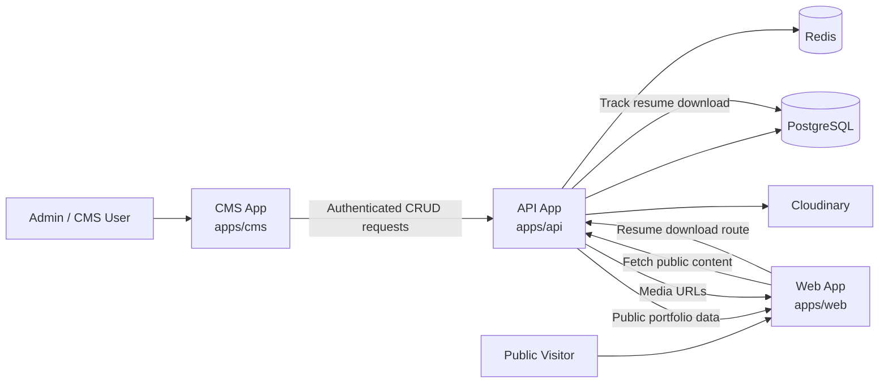

# NaufalIlyasa Portfolio Platform

Monorepo ini adalah platform portofolio pribadi yang menggabungkan website publik, CMS internal, dan backend API dalam satu codebase.

This monorepo is a personal portfolio platform that combines a public website, an internal CMS, and a backend API in a single codebase.

## Overview / Gambaran Umum

Project ini dibuat supaya seluruh konten portofolio tidak hardcoded di frontend. Data dikelola lewat CMS, diproses oleh API, disimpan di PostgreSQL, lalu ditampilkan di website publik.

This project is designed so the portfolio content is not hardcoded in the frontend. Content is managed through the CMS, processed by the API, stored in PostgreSQL, and then rendered on the public website.

Arsitektur utamanya terdiri dari:

The core architecture consists of:

- `apps/web` - website portfolio publik berbasis Next.js / public portfolio website built with Next.js
- `apps/cms` - dashboard admin/CMS berbasis React + Vite / admin dashboard and CMS built with React + Vite
- `apps/api` - REST API berbasis Express + Prisma / Express + Prisma REST API
- `packages/*` - shared UI, shared types, dan shared validation schemas / shared UI, types, and validation schemas

## Main Features / Fitur Utama

### Public Portfolio Website (`apps/web`)

- Homepage dinamis yang menampilkan profil, bio, social links, teknologi, experience, education, blog terbaru, dan featured projects
- Dynamic homepage that renders profile data, bio, social links, technologies, experience, education, latest blogs, and featured projects
- Halaman daftar proyek dan detail proyek berbasis slug di `/projects` dan `/projects/[slug]`
- Project listing and slug-based project detail pages at `/projects` and `/projects/[slug]`
- Halaman daftar blog dan detail blog berbasis slug di `/blogs` dan `/blogs/[slug]`
- Blog listing and slug-based blog detail pages at `/blogs` and `/blogs/[slug]`
- Render konten rich text dari Editor.js JSON untuk detail project dan artikel blog
- Rich text rendering from Editor.js JSON for project details and blog articles
- Resume download route di `/api/resume` yang mencatat analytics lalu redirect ke file resume terbaru
- Resume download route at `/api/resume` that records analytics and then redirects to the latest resume file
- Fetch data publik dari endpoint `/api/public/*` dengan revalidation 60 detik
- Public data fetching from `/api/public/*` endpoints with 60-second revalidation

### CMS / Admin Dashboard (`apps/cms`)

- Login, register, logout, dan refresh token otomatis saat sesi kedaluwarsa
- Login, register, logout, and automatic token refresh when the session expires
- Protected dashboard routes dengan redirect ke halaman login jika user belum terautentikasi
- Protected dashboard routes with redirect to the login page when the user is not authenticated
- Dashboard overview untuk statistik dan ringkasan konten
- Dashboard overview for content statistics and summary
- CRUD project lengkap: create, edit, delete, featured toggle, upload thumbnail, dan editor detail project
- Full project CRUD: create, edit, delete, featured toggle, thumbnail upload, and detailed project editor
- CRUD blog lengkap: create, edit, delete, publish/draft, duplicate post, kategori, tag, dan editor artikel
- Full blog CRUD: create, edit, delete, publish/draft, duplicate post, categories, tags, and article editor
- Pengelolaan profile owner, experience, dan education
- Management of owner profile, experience, and education
- Halaman analytics dengan chart dan komponen statistik
- Analytics page with charts and statistic components

### Backend API (`apps/api`)

- REST API berbasis Express + TypeScript dengan arsitektur `routes -> controllers -> services`
- Express + TypeScript REST API with a `routes -> controllers -> services` architecture
- Auth endpoints: login, register, logout, refresh token, dan `me`
- Auth endpoints: login, register, logout, refresh token, and `me`
- Public endpoints untuk website: user profile, projects, blogs, technologies, dan tracking resume download
- Public endpoints for the website: user profile, projects, blogs, technologies, and resume download tracking
- Protected CMS endpoints untuk projects, blogs, profiles, experiences, educations, upload, dan analytics
- Protected CMS endpoints for projects, blogs, profiles, experiences, educations, upload, and analytics
- JWT access/refresh token, Redis-backed session flow, rate limiting, CORS whitelist, dan media upload ke Cloudinary
- JWT access/refresh tokens, Redis-backed session flow, rate limiting, CORS whitelist, and media upload to Cloudinary
- Validasi env dengan `envalid`, validasi payload dengan Zod, dan test backend dengan Vitest + Supertest
- Environment validation with `envalid`, payload validation with Zod, and backend tests with Vitest + Supertest

## Data Model / Model Data

Database Prisma pada project ini mencakup entitas berikut:

The Prisma database schema in this project includes the following entities:

- `User`
- `Project`, `ProjectDetail`, `ProjectThumbnail`, `ProjectTechnology`
- `BlogPost`, `BlogThumbnail`, `Category`, `Tag`
- `WorkExperience`, `ExperienceTechnology`
- `Education`
- `Technology`, `UserTechnology`
- `ProfileView`, `ProjectView`, `ResumeDownload`

Artinya, seluruh isi portofolio bersifat data-driven dan bisa dikelola lewat CMS.

This means the entire portfolio is data-driven and manageable through the CMS.

## Monorepo Structure / Struktur Monorepo

```text
.
|- apps/
|  |- api/      # Express API + Prisma + Redis + Cloudinary
|  |- cms/      # React + Vite CMS dashboard
|  `- web/      # Next.js public portfolio
|- packages/
|  |- types/               # shared TypeScript contracts
|  |- zod-schemas/         # shared validation schemas
|  |- ui/                  # shared UI/components/utils
|  |- eslint-config/
|  `- typescript-config/
|- turbo.json
`- pnpm-workspace.yaml
```

## Tech Stack

- **Monorepo**: Turborepo, PNPM Workspace
- **Web**: Next.js 16, React 19
- **CMS**: Vite, React 19, TanStack Router, TanStack Query, React Hook Form, Zustand, Recharts, Editor.js
- **API**: Express 5, TypeScript, Prisma, PostgreSQL, Redis, JWT, Multer, Cloudinary, Zod
- **Shared Packages**: `@repo/types`, `@repo/zod-schemas`, `@repo/ui`

## Local Setup / Menjalankan Project Secara Lokal

### Prerequisites / Prasyarat

- Node.js >= 20
- PNPM >= 10
- Docker

### 1. Install dependencies

```bash
pnpm install
```

### 2. Start PostgreSQL and Redis

```bash
docker compose -f apps/api/docker-compose.yml up -d
```

Service lokal yang tersedia:

Available local services:

- PostgreSQL: `localhost:6501`
- Redis: `localhost:6380`

### 3. Copy env example files

Gunakan file `.env.example` yang sudah saya tambahkan sebagai template awal.

Use the `.env.example` files I added as your starting templates.

```bash
cp apps/api/.env.example apps/api/.env
cp apps/web/.env.example apps/web/.env
cp apps/cms/.env.example apps/cms/.env
```

Jika kamu ingin memakai naming Next.js yang lebih umum untuk local env, kamu juga bisa copy file web ke `.env.local`:

If you prefer the more common Next.js local env naming, you can also copy the web file into `.env.local`:

```bash
cp apps/web/.env.example apps/web/.env.local
```

### 4. Fill the environment variables / Isi environment variables

#### `apps/api/.env`

Wajib diisi karena divalidasi langsung oleh `apps/api/src/config/config.ts`.

Required because these values are validated directly by `apps/api/src/config/config.ts`.

- `DATABASE_URL`
- `REDIS_URL`
- `CMS_URL`
- `WEB_URL`
- `JWT_ACCESS_TOKEN_PRIVATE_KEY`
- `JWT_ACCESS_TOKEN_PUBLIC_KEY`
- `JWT_REFRESH_TOKEN_PRIVATE_KEY`
- `JWT_REFRESH_TOKEN_PUBLIC_KEY`
- `CLOUDINARY_CLOUD_NAME`
- `CLOUDINARY_API_KEY`
- `CLOUDINARY_API_SECRET`
- `BASE_URL`
- `NODE_ENV`
- `PORT`
- `USER_ID`

#### `apps/web/.env` or `apps/web/.env.local`

- `NEXT_PUBLIC_API_URL` - contoh / example: `http://localhost:8000/api`

#### `apps/cms/.env`

- `VITE_API_URL` - contoh / example: `http://localhost:8000`

### 5. Run Prisma migrations

```bash
pnpm --filter api exec prisma migrate deploy
```

### 6. Start the apps

```bash
pnpm dev
```

Perintah ini akan menjalankan seluruh app di workspace melalui `turbo dev`.

This command runs all workspace apps through `turbo dev`.

## Useful Commands / Command Penting

### Root

- `pnpm dev`
- `pnpm build`
- `pnpm lint`
- `pnpm type-check`
- `pnpm test:watch`

### API

- `pnpm --filter api dev`
- `pnpm --filter api build`
- `pnpm --filter api test`
- `pnpm --filter api test:ci`
- `pnpm --filter api coverage`

### Web

- `pnpm --filter web dev`
- `pnpm --filter web build`
- `pnpm --filter web start`

### CMS

- `pnpm --filter cms dev`
- `pnpm --filter cms build`
- `pnpm --filter cms preview`

## Content Flow / Alur Konten

1. Admin login ke CMS / Admin logs into the CMS.
2. Admin membuat atau mengubah konten / Admin creates or updates content.
3. CMS mengirim request terautentikasi ke API / CMS sends authenticated requests to the API.
4. API memvalidasi data, menyimpan ke PostgreSQL, dan upload media ke Cloudinary / API validates data, stores it in PostgreSQL, and uploads media to Cloudinary.
5. Website publik mengambil data dari endpoint `/api/public/*` / The public website fetches data from `/api/public/*` endpoints.
6. Visitor melihat konten terbaru dan event tertentu dicatat untuk analytics / Visitors see the latest content and selected events are recorded for analytics.

## Architecture Diagram / Diagram Arsitektur



Diagram ini menunjukkan dua alur utama: CMS untuk mengelola konten secara terautentikasi, dan website publik untuk membaca data portofolio yang sudah dipublikasikan.

This diagram shows the two main flows: the CMS for authenticated content management, and the public website for reading published portfolio data.

## Env Bootstrap Flow / Alur Copy `.env.example`

Kalau ingin onboarding cepat untuk developer baru, urutan yang direkomendasikan adalah:

For fast onboarding of a new developer, the recommended order is:

1. Clone repository
2. Jalankan `pnpm install`
3. Jalankan PostgreSQL + Redis dengan Docker Compose
4. Copy semua `.env.example` menjadi `.env`
5. Isi value yang masih placeholder
6. Jalankan migrasi Prisma
7. Jalankan `pnpm dev`

Contoh singkat:

Quick example:

```bash
pnpm install
docker compose -f apps/api/docker-compose.yml up -d
cp apps/api/.env.example apps/api/.env
cp apps/web/.env.example apps/web/.env.local
cp apps/cms/.env.example apps/cms/.env
pnpm --filter api exec prisma migrate deploy
pnpm dev
```

## Deployment Notes / Catatan Deployment

- Set origin `CMS_URL` dan `WEB_URL` sesuai domain production
- Set `CMS_URL` and `WEB_URL` to the correct production domains
- Pastikan seluruh JWT key dan kredensial Cloudinary tersedia di environment deployment
- Make sure all JWT keys and Cloudinary credentials are available in the deployment environment
- Repository ini sudah memiliki file `vercel.json` pada `apps/api`, `apps/cms`, dan `apps/web`
- This repository already contains `vercel.json` files in `apps/api`, `apps/cms`, and `apps/web`
